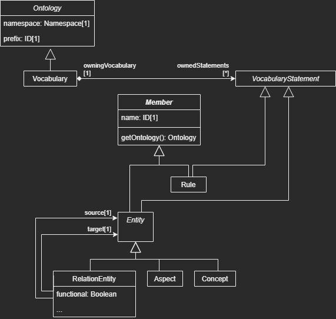

# OML in Lean4

This repository is about experiments about specifying the [Ontological Modeling Language, OML](https://github.com/opencaesar/oml), in [Lean4](https://leanprover.github.io/).

The inspiration for this experiment stems from the following discussion on the [Lean4 discord topic about OO polymorphism](https://leanprover.zulipchat.com/#narrow/stream/270676-lean4/topic/OO.20polymorphism.3F), which inspired the following article by [Juan Pablo Romero](https://typista.org/subtyping-and-polymorphism-in-lean/).

## How to work with this repository?

- Follow the [Lean Manual Quickstart](https://leanprover.github.io/lean4/doc/quickstart.html) to setup a VS-Code IDE with the Lean extension

- Clone this repository

- Open the clone in VS Code (assuming the Lean4 extension is installed).

## Examples from the OO polymorphism discussion

- [src/Oml/O1.lean: Jason Rute's proposal](src/Oml/O1.lean)

- [src/Oml/O2.lean: Juan Pablo Romero's proposal](src/Oml/O2.lean)

- [src/Oml/O3.lean: Mario Carneiro's 1st proposal](src/Oml/O3.lean)

- [src/Oml/O4.lean: Kyle Miller's proposal](src/Oml/O4.lean)

- [src/Oml/O41.lean: A variant of Kyle Miller's proposal using a suggestion from Yaël Dillies](src/Oml/O41.lean)

- [src/Oml/O5.lean: Mario Carneiro's 2nd proposal](src/Oml/O5.lean)

## How do we specify an [XCore](https://wiki.eclipse.org/Xcore) metamodel in Lean?

For [OML](https://github.com/opencaesar/oml), we want to encode the [Oml.xcore](https://github.com/opencaesar/oml/blob/master/io.opencaesar.oml/src/io/opencaesar/oml/Oml.xcore) metamodel.

This question relates to the OO polymorphism discussion because Xcore relies on the underlying Java Virtual Machine as the formalism for defining a metamodel as a set of Java classes and properties and for representing a model as Java objects created as instances of the metamodel Java classes.

For example, consider the following simplified snippet of the `Oml.xcore` metamodel:

```xcore
type ID wraps String

type Namespace wraps String

/* Ontology represents a namespace defined by a globally unique namespace 
 * (an iri and a namespace separator that can be # or /) and can be abbreviated with a prefix. */
abstract class Ontology {
    /* The globally unique namespace of this ontology */
    Namespace[1] namespace
    /* The prefix of this ontology's namespace */
    ID[1] prefix
}

/* A Vocabulary allows making statements about its own terms and rules or about others that are imported. */
class Vocabulary extends Ontology {
    /* The set of statements contained by this vocabulary. */
    contains VocabularyStatement[*] ownedStatements opposite owningVocabulary
}

/* VocabularyStatement is a statement owned by a vocabulary. */
abstract class VocabularyStatement {
    /* The vocabulary that owns this statement */
    container Vocabulary[1] owningVocabulary opposite ownedStatements
}

/*
 * Member is an identified element defined by an ontology. Its IRI is unique and derived by concatenating the globally
 * unique namespace of its ontology with its locally unique name (i.e., member.iri=ontology.namespace+member.name).
 */
abstract class Member {
    /* The name of this member, which is unique within its ontology's namespace */
    id ID[1] name
    /* Gets the ontology that defines this element */
    op Ontology getOntology()
}

/* Rule is a member of a vocabulary that adds a new inference rule to the set supported natively by DL. */
class Rule extends Member, VocabularyStatement {}

/* Entity is a characterizable type whose instances can be interrelated by relations (that have the entity
 * or one of its specialized entities as their domain). It can also specify constraints on relations in its domain. */
abstract class Entity extends Member {}

/* Aspect is an entity that represents a concern that cuts across multiple entities. It does not directly 
 * classify instances, but it does so indirectly by being specialized by other entities. However, an aspect can only 
 * specialize other aspects. */
class Aspect extends Entity {}

/* Concept is a concrete entity */
class Concept extends Entity {}

/* RelationEntity is a concrete entity that can classify a set of relation instances in a description. 
 * A relation entity relates two entities.
 * A relation entity can also be characterized with several boolean flags, representing DL semantics.
 */
class RelationEntity extends Entity {
    /* The entity that represents the source of this relation entity */
    refers Entity[1] source
    /* The entity that represents the target of this relation entity */
    refers Entity[1] target
    /* Whether this relation entity is functional (i.e., {@code A -> B and A->C => B=C}) */
    boolean functional
    /* Whether this relation entity is inverse functional (i.e., {@code B->A and C->A => B=C}) */
    boolean inverseFunctional
    /* Whether this relation entity is symmetric (i.e., {@code A->B => B->A}) */
    boolean symmetric
    /* Whether this relation entity is asymmetric (i.e., {@code A->B => !(B->A)}) */
    boolean asymmetric
    /* Whether this relation entity is reflexive (i.e., {@code A => A->A}) */
    boolean reflexive
    /* Whether this relation entity is irreflexive (i.e., {@code A => !(A->A)}) */
    boolean irreflexive
    /* Whether this relation entity is irreflexive (i.e., {@code A->B and B->C => A->C}) */
    boolean transitive
}
```

The following UML class diagram illustrates the metamodel above:



This simplified subset of OML illustrates a few important aspects of a metamodel that should be preserved in their Lean4 equivalent encoding:

- Containment semantics

  A given `VocabularyStatement` instance has a single `owningVocabulary` for which it is part of its `ownedStatements`.

- Preserving identity

  Structurally, `Concept` and `Aspect` have the same information (`Member.name` and `Member.getOntology()`); however, semantically, their instances in the `Vocabulary.ownedStatements` collection must retain information about what they really are as [Kyle Miller puts it](https://leanprover.zulipchat.com/#narrow/stream/270676-lean4/topic/OO.20polymorphism.3F/near/297629381).

- Abstract vs. concrete metaclasses

  At the model level, each model instance must be created as an instance of a single concrete metaclass; i.e.: `Vocabulary`, `Rule`, `Aspect`, `Concept`, or `RelationEntity`.

The class diagram notation involves notable peculiarities:

- Implied optional types

  Metamodeling notations do not have a generic option type, instead, a type without a suffix is implicitly understood as an optional type. For example, `Member.getOntology() : Ontology` is equivalent to `Member.getOntology() : Option Ontology`. For scalar types like `Boolean`, the option corresponds to a default value; for example: `RelationEntity.functional : Boolean` is equivalent to `RelationEntity.functional : Boolean = false`.

- Required features

  Typically, an instance of a metaclass is considered well-formed when every feature has a value that conforms to the feature type and multiplicty. For example, `RelationEntity.source : Entity[1]` means that an instance of `RelationEntity` is well-formed when its `RelationEntity.source` feature has exactly 1 instance of kind `Entity`.

## Summary of simplified OML metamodel encodings.

- [src/Oml/Oml1.lean](src/Oml/Oml1.lean), [src/Oml/Oml2.lean](src/Oml/Oml2.lean)

  These experiments began with the full OML metamodel with a simple encoding strategy:

  - An abstract metaclass is encoded as a structure.
  - A concrete metaclass is encoded as a class.
  - Metaclass inheritance is encoded as structure/class extension.
  - Structurally essential metaclass features are encoded as structure/class properties.

  This approach is inadequate for several reasons:

  - Lean's structure inheritance corresponds to lossy projection functions from subtypes to supertypes.

    Unlike upcasting in OO, the result of the supertype projection cannot be converted back to its original subtype.

  - Lean's containers are not OO containers.

    JVM-based metamodel frameworks expect generic collections to store instances of all concrete subtypes
    of their type parameter without loss of information. For example, consider: `Vocabulary.ownedStatements : VocabularyStatements[*]`.
    Although the [Ecore](https://wiki.eclipse.org/Ecore)-based Java code would involve `java.util.List[VocabularyStatement]`, the unicity
    requirements would be more faithfully encoded with a set container instead: `java.util.Set[VocabularyStatement]`.

    Lean's collection library does not behave like Java's or Scala's OO collection library.

  To address these issues, it is necessary to switch from a structure/class encoding to a strategy like [Mario Carneiro's 2nd proposal](src/Oml/O5.lean) or to define a layer of modeling infrastructure to keep track of object's metaclasses using a type class technique for modeling polymorphism as [Kyle Miller suggested](src/Oml/O4.lean). Kyle's suggestion reflects the paradigm described in the [Functional Programming in Lean book, section 4.2](https://leanprover.github.io/functional_programming_in_lean/type-classes/polymorphism.html) albeit the book lacks a clear example of polymorphic subtyping.
